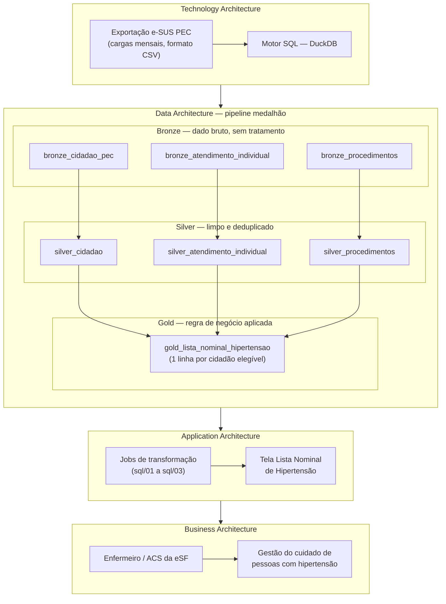

# Arquitetura do pipeline — Lista Nominal de Hipertensão

Diagrama estruturado segundo os quatro domínios do TOGAF (**BDAT** — Business,
Data, Application, Technology Architecture), que correspondem às fases B/C/D
do ADM. Cada raia abaixo é um domínio; o fluxo sobe de Technology (fonte do
dado) até Business (o uso pela equipe de saúde).

## Diagrama

## Onde cada regra de negócio é aplicada

| Regra | Camada | Por quê |
|---|---|---|
| Deduplicação de registros retransmitidos em cargas incrementais (manter a versão mais recente por chave) | **Silver** | É tratamento de qualidade do dado, não regra clínica — precisa estar resolvido antes de qualquer cálculo de negócio. |
| Critério de entrada (diagnóstico de hipertensão por médico/enfermeiro) e saída (óbito ou condição resolvida) da lista | **Gold** | Depende da combinação de eventos ao longo do histórico da pessoa — só é possível decidir depois que os fatos já estão limpos e consolidados. |
| Cálculo dos três status (Em dia / Atrasada / Nunca realizada) das boas práticas | **Gold** | Mesma razão: é a regra que transforma fatos silver em informação de negócio, específica desta tabela de destino. |

Detalhes de implementação e decisões documentadas em comentário SQL: [`sql/02_silver.sql`](../sql/02_silver.sql) e [`sql/03_gold.sql`](../sql/03_gold.sql).

## Schema da tabela final — `gold_lista_nominal_hipertensao`

**Granularidade:** 1 linha por cidadão elegível para a lista (hipertenso, vivo, sem condição resolvida como status mais recente).

| Coluna | Tipo | Chave | Descrição |
|---|---|---|---|
| `co_fat_cidadao_pec` | BIGINT | **PK** | Identificador do cidadão |
| `no_cidadao` | VARCHAR | | Nome do cidadão |
| `nu_cns` | VARCHAR | | Cartão Nacional de Saúde |
| `nu_cpf_cidadao` | VARCHAR | | CPF — alternativa quando não há CNS |
| `dt_registro_nascimento` | DATE | | Data de nascimento |
| `idade` | INTEGER | | Idade calculada em relação a 2026-08-01 |
| `nu_telefone_celular` | VARCHAR | | Contato para ação da equipe |
| `nu_ine` | VARCHAR | | Equipe de vínculo do cidadão |
| `no_equipe` | VARCHAR | | Nome da equipe de vínculo |
| `dt_ultima_consulta` | DATE | | Data do atendimento mais recente (médico/enfermeiro) |
| `status_consulta` | VARCHAR | | Em dia / Atrasada / Nunca realizada — janela de 6 meses |
| `dt_ultima_afericao_pressao` | DATE | | Data da aferição de pressão mais recente |
| `valor_ultima_afericao_pressao` | VARCHAR | | Leitura mais recente, ex. "110/90" |
| `status_afericao_pressao` | VARCHAR | | Em dia / Atrasada / Nunca realizada — janela de 6 meses |
| `dt_ultimo_peso_altura` | DATE | | Data do registro de peso e altura mais recente |
| `status_peso_altura` | VARCHAR | | Em dia / Atrasada / Nunca realizada — janela de 12 meses |

## Limitações conhecidas

**Microárea ausente.** O protótipo tem coluna "Território" (microárea + telefone) e filtro por microárea, mas nenhuma das três tabelas brutas (`cidadao_pec`, `atendimento_individual`, `procedimentos`) carrega esse campo — só existe `nu_ine`/`no_equipe`, um nível acima.

Avaliamos e descartamos inferir a microárea a partir do DDD de `nu_telefone_celular`: são 1.200 telefones distintos para 1.200 cidadãos, com DDDs que não se repetem nem dentro da mesma equipe — não há correlação geográfica real, e um filtro de território baseado nisso agruparia pessoas erradas numa ferramenta cujo uso é decidir quem visitar. O risco de dado errado pesou mais que ter o filtro completo.

**Recomendação:** usar `no_equipe` como filtro territorial disponível hoje, e levar a ausência de microárea como item prioritário na mensagem ao time de engenharia de dados (entregável 4) — o e-SUS PEC capta microárea via ACS; é provável que só não esteja vindo nesta extração.
