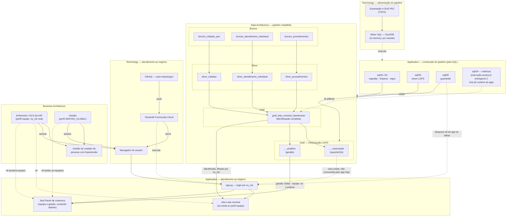

# Arquitetura da solução — TOGAF

Complemento ao [`entregaveis/01-diagrama-arquitetura.md`](../entregaveis/01-diagrama-arquitetura.md)
(entregável 1, oficial). Aquele arquivo cobre só o pipeline (bronze → silver →
gold) que o case pediu. Este documento cobre **a solução inteira** como foi
entregue — pipeline, privacidade/LGPD, guardrails, app com controle de acesso
e a infraestrutura de publicação — organizada nos quatro domínios do TOGAF
(BDAT) e usando os artefatos padrão do framework (catálogo, matriz, diagrama)
na medida em que cada um agrega algo real. Não é um exercício de ADM completo
— seria desproporcional para o tamanho da solução — é a estrutura BDAT
aplicada a todos os artefatos que existem hoje no repositório.

## Vision — motivador e escopo

| | |
|---|---|
| **Problema de negócio** | Equipes de saúde da família precisam saber, a qualquer momento, quem na lista de hipertensos está com acompanhamento em dia, atrasado ou nunca realizado. |
| **Stakeholders** | Enfermeiro/ACS da eSF (usuário operacional), gestão (visão agregada), time de produto, time de engenharia de dados (origem do dado), encarregado/DPO (LGPD). |
| **Escopo desta versão** | Da extração bruta do e-SUS PEC até duas superfícies de consumo: a tela operacional (Lista Nominal) e o painel gerencial — publicadas como app web. |
| **Fora de escopo** | Ingestão automatizada/agendada, banco de produção real, autenticação corporativa (SSO), log de auditoria — ver limitações em cada seção. |

## Diagrama



## 1. Business Architecture

**Catálogo de atores e papéis**

| Ator | Papel | Acessa |
|---|---|---|
| Enfermeiro / ACS da eSF | Ação sobre a própria equipe — ligar, agendar, visitar | Lista nominal identificada da própria equipe (`nu_ine`) |
| Gestão | Supervisão de todas as equipes, sem agir sobre indivíduo | Painel agregado de todas as equipes, sem identificação |
| Time de produto | Dono da tela, decide regras de negócio e prioriza melhorias | `entregaveis/03-documentacao-produto.md` |
| Time de engenharia de dados | Origem do dado bruto (e-SUS PEC) | `entregaveis/04-mensagem-engenharia-dados.md` |
| Encarregado/DPO | Garante conformidade LGPD do tratamento | `extras/lgpd-notas.md` |

**Processo de negócio (fluxo de valor)**

```
extração mensal e-SUS PEC → pipeline recalcula a lista → equipe abre o app →
identifica quem está atrasado → liga / agenda / prioriza visita
```

**Serviço de negócio**: gestão do cuidado de pessoas com hipertensão na
atenção primária — o mesmo de `entregaveis/01-diagrama-arquitetura.md`.

## 2. Data Architecture

**Catálogo de entidades de dado, por camada**

| Camada | Entidade | Papel |
|---|---|---|
| Bronze | `bronze_cidadao_pec`, `bronze_atendimento_individual`, `bronze_procedimentos` | Espelho dos 3 CSVs, tipagem defensiva, sem tratamento de regra |
| Silver | `silver_cidadao`, `silver_atendimento_individual`, `silver_procedimentos` | Deduplicado, chaves e domínios validados |
| Gold | `gold_lista_nominal_hipertensao` | 1 linha por cidadão elegível — identificação completa |
| Gold (LGPD) | `gold_lista_nominal_hipertensao_mascarado` | Nome + CPF/CNS mascarados, sem telefone — suporte/QA |
| Gold (LGPD) | `gold_lista_nominal_hipertensao_analitico` | Sem identificador — equipe, faixa etária, status — gestão |

**Matriz de classificação de dado × finalidade** (de
[`lgpd-notas.md`](lgpd-notas.md)):

| View | Identificador direto | Dado sensível (saúde) | Consumidor |
|---|---|---|---|
| `gold_lista_nominal_hipertensao` | Sim (nome, CPF, CNS, telefone) | Sim | Equipe (ação individual) |
| `..._mascarado` | Parcial (nome + CPF/CNS mascarados) | Sim | Suporte/QA |
| `..._analitico` | Não | Sim (agregado) | Gestão |

**Base legal**: art. 11, II, "f" (tutela da saúde por profissional/serviço de
saúde), subsidiada por art. 7º, III (execução de política pública). Detalhe
completo em [`lgpd-notas.md`](lgpd-notas.md).

**Fluxo de dado** (diagrama): ver `entregaveis/01-diagrama-arquitetura.md` —
idêntico até a camada Gold; as views de LGPD (`05_privacidade_lgpd.sql`)
derivam de `gold_lista_nominal_hipertensao`, não da Silver.

## 3. Application Architecture

Mesma lógica da seção 4: uma parte constrói o pipeline (jobs SQL que
produzem as camadas de dado), a outra atende o negócio (o app Streamlit em
si, que o usuário efetivamente abre). `build_database()` (em `app.py`) roda
01→02→03→05→06 a cada boot; **`sql/04_metricas.sql` não está nessa lista** —
é execução avulsa, só para gerar os números do entregável 2, e lê
diretamente de `gold_lista_nominal_hipertensao` fora do runtime do app.

**Catálogo — construção do pipeline (jobs SQL, parte do runtime do app)**

| Componente | Arquivo | Função |
|---|---|---|
| Ingestão | `sql/01_bronze.sql` | `read_csv` com tipagem explícita dos 3 arquivos fonte |
| Limpeza | `sql/02_silver.sql` | Deduplicação, extração de JSON (`propriedades`) |
| Regra de negócio | `sql/03_gold.sql` | Critério de entrada/saída, cálculo dos 3 status |
| Minimização de dado | `sql/05_privacidade_lgpd.sql` | As 2 views derivadas por finalidade |
| Qualidade | `sql/06_guardrails.sql` | Assertions bloqueantes (`error()`) + alertas informativos, por camada |

**Fora do runtime do app**

| Componente | Arquivo | Função |
|---|---|---|
| Relatório | `sql/04_metricas.sql` | Números do entregável 2 (contagem + distribuição) — rodado manualmente, não pelo `app.py` |

**Catálogo — atendimento ao negócio**

| Componente | Arquivo | Função |
|---|---|---|
| Front-end | `app.py` | App Streamlit — único componente que orquestra os jobs acima e serve a UI |

**Componentes internos do `app.py`** (catálogo de funções/blocos):

| Bloco | O que faz |
|---|---|
| `build_database()` | `st.cache_resource` — roda 01→02→03→05→06 uma vez por sessão de servidor, conexão DuckDB in-memory |
| `faixa_etaria()`, `formata_situacao()`, `colore_status()` | Funções de apresentação (bucket de idade, rótulo, cor por status) |
| Login gate (`st.session_state.nu_ine_logado`) | Controle de acesso por `nu_ine`; `GESTAO_GLOBAL` é o sentinel do perfil gerencial |
| Aba "Lista nominal" | Só existe para perfil de equipe — filtra `gold` por `nu_ine` da sessão |
| Aba "Painel de cobertura" | Existe para os dois perfis — gestão vê `..._analitico` de todas as equipes; equipe vê a própria, via mesmo filtro por `nu_ine` |

**Matriz de acesso por perfil**

| Perfil | Lista nominal (identificada) | Painel de cobertura | Escopo de dado |
|---|---|---|---|
| Equipe (`nu_ine` real) | Sim — só a própria equipe | Sim — só a própria equipe | `gold` filtrado + `..._analitico` filtrado |
| Gestão (`GESTAO_GLOBAL`) | Não | Sim — todas as equipes | `..._analitico` sem filtro |

Controle de acesso vive na aplicação, não no banco — ver
[`lgpd-notas.md`](lgpd-notas.md) para a limitação registrada (sem RLS/roles
no DuckDB in-memory).

## 4. Technology Architecture

Duas raias, separadas no diagrama porque servem propósitos diferentes: uma
processa dado (roda a cada sessão do app), a outra distribui o app até o
usuário (roda uma vez por deploy).

**Catálogo — alimentação do pipeline**

| Camada | Tecnologia | Papel |
|---|---|---|
| Fonte | CSVs do e-SUS PEC | Exportação mensal, sem tratamento |
| Motor de dados | DuckDB (in-process, in-memory) | Executa as 6 camadas SQL a cada boot do app |

**Catálogo — atendimento ao negócio**

| Camada | Tecnologia | Papel |
|---|---|---|
| Controle de versão | GitHub (`ShirleiAlexandrino/case-impulsogov`, público) | Fonte única — código, SQL e dados fictícios versionados juntos |
| Hospedagem do app | Streamlit Community Cloud | Build a partir do repositório Git, redeploy automático em push na `main` |
| Front-end | Streamlit | Renderiza UI, gerencia sessão/login, gráficos (Altair) |
| CI/build | Nenhum pipeline dedicado — o próprio deploy do Streamlit Cloud instala `requirements.txt` e roda `app.py` | — |

**Diagrama de implantação**

```
GitHub (case-impulsogov, branch main)
        │  push
        ▼
Streamlit Community Cloud
  ├─ instala requirements.txt (streamlit, duckdb, pandas, altair)
  ├─ executa app.py
  │     └─ build_database() roda sql/01→02→03→05→06 num DuckDB in-memory
  └─ serve https://case-impulsogov-shirlei-alexandrino.streamlit.app/
                                │
                                ▼
                     navegador do usuário (equipe / gestão)
```

**Dependências declaradas** (`requirements.txt`): `streamlit`, `duckdb`,
`pandas`, `altair`. **Configuração**: `.streamlit/config.toml` (tema visual).
`.devcontainer/devcontainer.json` existe no repositório (gerado por um
Codespace aberto incidentalmente) mas não faz parte da solução — não é usado
no deploy.

## Artefatos da solução — inventário completo

Todo arquivo do repositório, mapeado ao domínio BDAT que ele implementa:

| Artefato | Domínio |
|---|---|
| `sql/01_bronze.sql`, `02_silver.sql`, `03_gold.sql`, `04_metricas.sql` | Data + Application |
| `sql/05_privacidade_lgpd.sql` | Data (minimização) |
| `sql/06_guardrails.sql` | Data (qualidade) |
| `app.py` | Application |
| `.streamlit/config.toml`, `requirements.txt` | Technology |
| `dados/*.csv` | Data (fonte) |
| `contexto/*.md`, `contexto/prototipo-lista-nominal.png` | Business (requisito/protótipo aprovado) |
| `entregaveis/01-05*.md` + `apresentacao/*.html` | Documentação dos entregáveis oficiais |
| `extras/lgpd-notas.md` | Data (governança) |
| `extras/arquitetura-togaf.md` (este arquivo) | Business+Data+Application+Technology |
| GitHub (`case-impulsogov`) + Streamlit Community Cloud | Technology (implantação) |

## Limitações conhecidas desta arquitetura

- **Sem Opportunities & Solutions / Migration Planning formais** — a solução
  já está implementada e implantada; não há um roadmap de fases porque o
  case não pediu evolução multi-release.
- **Sem Architecture Governance Board** — decisões de arquitetura
  documentadas em `entregaveis/03-documentacao-produto.md` (decisões
  ambíguas) e nos comentários SQL, não num processo de governança formal.
- **DuckDB in-memory por sessão** — não há persistência entre reinícios do
  processo Streamlit; cada boot recalcula tudo a partir dos CSVs. Aceitável
  para o volume do case, não para produção.
